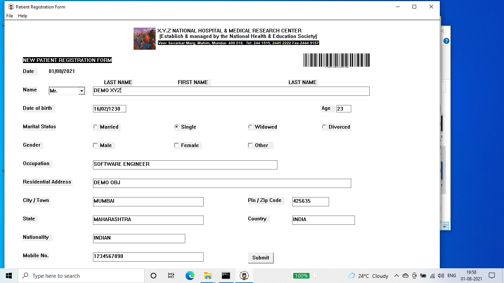

# Hospital-Registration-System-Win32

- Project Name : Hospital Registration System
- Technology Used: Win32 API ,C++ Programming 
- User Interface Used: Graphical line Interface (GUI)
- Platform Required : Windows NT
- Hardware Requirement: Intel 32 bit processor
- Description of  the Project: 
  - Project used to store the patient details in the file system
  - Developed using Win32 SDK which is used for Windows OS 

- Reference 
  - MSDN
  - Programming Windows, 5th Edition by Charles Petzold

